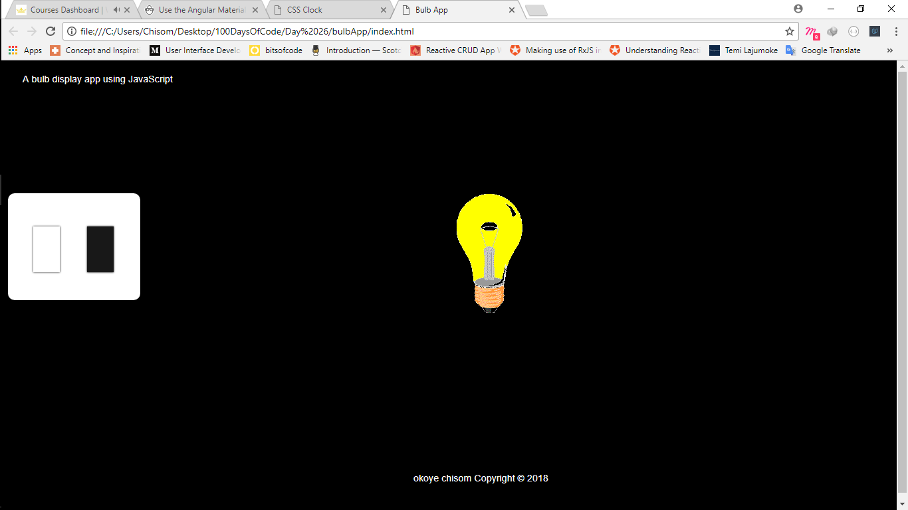

# Light Bulb App
This is a light bulb display application, that
toggle class active when clicked to indicate the 
state of the switch and display a bulb on image else it will display bulb off image.

* below is the snapshot of the application:

## To run the project on your system:
* Download the Project Folder.
* You can use a local server to open the index.html or just run the index.html file.
* Enjoy! and feel free to contribute to this project...
